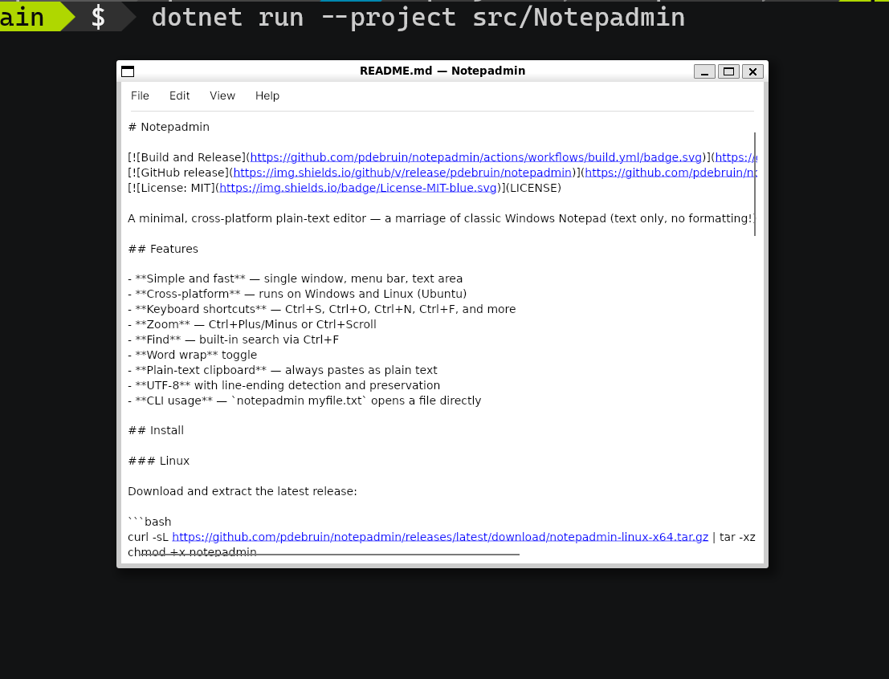

# Notepadmin

[](https://github.com/pdebruin/notepadmin/actions/workflows/build.yml)
[](https://github.com/pdebruin/notepadmin/releases/latest)
[](LICENSE)

A minimal, cross-platform plain-text editor — a marriage of classic Windows Notepad (text only, no formatting!) and gedit. Built with C#, .NET 10, and Avalonia UI.



## Features

- **Simple and fast** — single window, menu bar, text area
- **Cross-platform** — runs on Windows and Linux (Ubuntu)
- **Keyboard shortcuts** — Ctrl+S, Ctrl+O, Ctrl+N, Ctrl+F, and more
- **Zoom** — Ctrl+Plus/Minus or Ctrl+Scroll
- **Find** — built-in search via Ctrl+F
- **Word wrap** toggle
- **Plain-text clipboard** — always pastes as plain text
- **UTF-8** with line-ending detection and preservation
- **CLI usage** — `notepadmin myfile.txt` opens a file directly

## Install

### Linux

Download and extract the latest release:

```bash
curl -sL https://github.com/pdebruin/notepadmin/releases/latest/download/notepadmin-linux-x64.tar.gz | tar -xz
chmod +x notepadmin
./notepadmin
```

### Windows

Download `notepadmin-win-x64.zip` from the [latest release](https://github.com/pdebruin/notepadmin/releases/latest), extract, and run `notepadmin.exe`.

## Building from Source

Requires [.NET 10 SDK](https://dotnet.microsoft.com/download).

```bash
cd v1
dotnet run --project src/Notepadmin
```

### Publish a self-contained binary

```bash
dotnet publish v1/src/Notepadmin/Notepadmin.csproj -c Release -r linux-x64 -o publish/linux-x64
dotnet publish v1/src/Notepadmin/Notepadmin.csproj -c Release -r win-x64 -o publish/win-x64
```

### Linux prerequisites

On minimal or headless Linux installs (e.g. WSL2), you may need X11 libraries:

```bash
sudo apt install libice6 libsm6
```

A full Ubuntu Desktop installation already includes these.

## Keyboard Shortcuts

| Shortcut | Action |
|---|---|
| Ctrl+N | New |
| Ctrl+O | Open |
| Ctrl+S | Save |
| Ctrl+Shift+S | Save As |
| Ctrl+W / Ctrl+F4 | Close |
| Ctrl+Z | Undo |
| Ctrl+Y | Redo |
| Ctrl+X / C / V | Cut / Copy / Paste |
| Ctrl+A | Select All |
| Ctrl+F | Find |
| Ctrl+Plus / Minus | Zoom In / Out |
| Ctrl+Scroll | Zoom In / Out |
| Alt+F4 | Exit |

## License

MIT
